# 🎨 PromptPalette Web — 提示词便签管家

> **提示词管理 + 便签组合 + AI 对话**，一站式云端工具。
>
> 在线体验：[主站](https://palette.lunisolar.de5.net) ｜ [GitHub 演示站](https://dming623.github.io/prompt-palette-web/)

---

## 目录

- [功能特性](#功能特性)
- [技术架构](#技术架构)
- [权限模型](#权限模型)
- [快速开始](#快速开始)
- [部署指南](#部署指南)
- [API 参考](#api-参考)
- [数据格式](#数据格式)
- [常见问题](#常见问题)

---

## 功能特性

### 📋 便签管理

将提示词按**标签分类**管理，每个标签下可包含多个**便签**（即提示词卡片）。

| 功能 | 说明 |
| :--- | :--- |
| **标签管理** | 新建、切换、重命名标签（管理员）；游客只读查看 |
| **便签 CRUD** | 每个标签下可增删改便签，含名称 + 内容（提示词） |
| **实时搜索** | 在便签列表中按名称或内容关键词模糊搜索 |
| **一键复制** | 每张便签卡片底部"复制"按钮，直接写入剪贴板 |
| **查看全文** | 点击"查看"弹出模态框展示完整内容，同时可复制 |

### 🧩 组合面板

将多个 Tag 按顺序组合成一条完整的提示词。

| 功能 | 说明 |
| :--- | :--- |
| **Tag 组合** | 从独立 Tag 列表中点击选择，按点击顺序自动编号、拼接 |
| **CSV 导入/导出** | 支持 name/cn_name/wiki 三列的 CSV 格式，自动追加合并、去重 |
| **一键复制/清空** | 组合结果可一键复制到剪贴板或清空重选 |
| **搜索过滤** | 实时搜索 Tag（按 name/cn_name/wiki 模糊匹配） |
| **分块渲染** | 大数量 Tag 时采用增量渲染（每次 120 个），滚动自动加载，搜索防抖 |
| **编码兼容** | 导入时自动检测 UTF-8（含 BOM）/ GB18030 编码，避免中文乱码 |

### 🤖 AI 助手

内置 AI 对话面板，支持流式对话与工具调用。

| 功能 | 说明 |
| :--- | :--- |
| **OpenAI 兼容** | 支持任意 OpenAI 兼容 API（如 GPT、DeepSeek、Kimi 等） |
| **SSE 流式输出** | 无工具模式下直接透传上游 SSE 流，实时显示 token 级输出 |
| **工具调用** | AI 可调用 `list_tags`、`get_note_content`、`search_local_tags` 等工具（读写分离） |
| **MCP 协议** | 支持 Streamable HTTP 格式的 MCP 工具，后端代理转发 |
| **多对话历史** | 侧边栏管理，离线保存到 localStorage，支持切换/删除/新建 |
| **Markdown 渲染** | AI 回复自动渲染 Markdown（代码块复制、表格、链接等） |
| **自定义 System Prompt** | 管理员和游客可分别设置自己的系统提示 |
| **上下文轮次限制** | 可控制发送给 AI 的历史轮次，节约 Token 消耗 |

### 🔐 数据导入导出

| 功能 | 说明 |
| :--- | :--- |
| **JSON 导出** | 管理员一键导出完整数据（主标签 + 独立 Tag），JSON 格式 |
| **JSON 导入** | 支持 Web 版导出格式与油猴旧格式（自动识别，含 `notes` 字段的视为主数据） |
| **CSV 导入导出** | Tag 组合面板专属，单独管理，不干扰主数据 |
| **编码自动检测** | 导入时自动识别 UTF-8 / GB18030 编码，避免乱码 |

---

## 技术架构

```mermaid
flowchart TB
    subgraph 浏览器端[浏览器端 — Vue 3 + Vite]
        NV[📋 NotesView<br/>便签管理]
        CV[🧩 ComposerView<br/>组合面板]
        AV[🤖 AiView<br/>AI 对话面板]
        API[📡 api.js<br/>自动检测部署域名<br/>同域→相对路径 ｜ 跨域→线上 Worker]
        NV & CV & AV --> API
    end

    subgraph CF[Cloudflare Workers — 边缘计算]
        subgraph Worker[worker/index.js]
            AUTH[🔐 认证<br/>HMAC-SHA256 Cookie]
            CRUD[💾 CRUD<br/>KV 读写 + 数据校验]
            AI[🧠 AI 代理<br/>SSE 透传 / 工具循环]
            MCP[🔌 MCP 代理<br/>SSE 解析 / JSON-RPC]
            CORS[🌐 CORS<br/>动态 Origin 回显]
        end
        KV[(🗂️ KV 存储<br/>main_data / tags_data)]
        ASSETS[(📦 ASSETS<br/>Vite 构建物)]
        Worker --> KV & ASSETS
    end

    subgraph External[外部服务]
        AIAPI[🤖 OpenAI 兼容 API]
        MCP_SRV[🔌 MCP 服务器<br/>Tavily 等]
    end

    API -->|HTTP/HTTPS| Worker
    AI --> AIAPI
    MCP --> MCP_SRV

    style 浏览器端 fill:#1e293b,stroke:#64748b
    style CF fill:#1e1b4b,stroke:#6366f1
    style External fill:#1a1a2e,stroke:#e2e8f0
```



### 前端技术栈

| 层 | 技术 | 说明 |
| :--- | :--- | :--- |
| 框架 | **Vue 3** (Composition API + `<script setup>`) | 响应式视图层 |
| 构建 | **Vite 6** | 极速开发体验，`base: './'` 兼容子路径部署 |
| 状态管理 | **Vue reactive** 轻量状态 | 全局 store + 每个组件本地 ref |
| 样式 | **CSS 变量** + 暗色主题 | 深色背景 + 渐变点缀，滚动条美化 |
| 编码 | 前端 `TextDecoder` 自动检测 | UTF-8 → GB18030 回退，BOM 处理 |
| 渲染 | 分块增量渲染 | Tag 列表每次 120 个，滚动加载，搜索防抖 |

### 后端技术栈

| 层 | 技术 | 说明 |
| :--- | :--- | :--- |
| 运行时 | **Cloudflare Workers** | 边缘计算，低延迟 |
| 存储 | **Cloudflare KV** | 最终一致性键值存储，30s 内存缓存加速 |
| 认证 | **HMAC-SHA256 签名 Cookie** | 管理员登录凭据，同域 Lax / 跨域 None+Secure |
| CORS | **动态 Origin 回显** | 支持 GitHub Pages 演示站跨域调用，配合 credentials |
| AI 代理 | **非流式工具循环 + 流式 SSE 透传** | 无工具时透传上游 SSE，有工具时循环执行 function calling |
| MCP 代理 | **JSON-RPC over HTTP** | 转发 initialize / tools/list / tools/call |

---

## 权限模型

| 能力 | 游客 | 管理员 |
| :--- | :---: | :---: |
| 查看标签/便签/独立 Tag | ✅ | ✅ |
| 便签组合 / Tag 组合 / 复制 | ✅ | ✅ |
| AI 对话 | ✅（自带 API URL + Key） | ✅（使用环境变量） |
| 增删改标签/便签/独立 Tag | ❌ | ✅ |
| 导入导出 JSON 备份 | ❌ | ✅ |
| AI 工具调用 | 只读（查看/搜索） | 读写（增/删/改） |

> **安全设计**：管理员登录凭据使用 HMAC-SHA256 签名的 HttpOnly Cookie，`ADMIN_PASSWORD` 等敏感信息存储在 Cloudflare Secrets（绝不进入代码仓库）。游客 AI 请求通过 `X-API-URL` / `X-API-Key` 请求头透传，后端绝不注入管理员密钥。

---

## 快速开始

### 线上使用

直接访问 https://palette.lunisolar.de5.net

- **游客**：无需登录，直接浏览便签、组合 Tag、使用 AI（需自备 API Key）
- **管理员**：点击右上角「登录管理」输入用户名密码

### 本地开发

```bash
# 克隆
git clone https://github.com/DMing623/prompt-palette-web.git
cd prompt-palette-web

# 前端开发
cd web && npm install && npm run dev

# Worker 本地调试（需先配置 KV 和 secrets）
cd .. && wrangler dev
```

---

## 部署指南

### 前置条件

- Node.js >= 18
- Cloudflare 账户，安装 [wrangler CLI](https://developers.cloudflare.com/workers/wrangler/)

### 部署步骤

```bash
# 1. 登录
wrangler login

# 2. 初始化配置
cd prompt-palette-web
cp wrangler.toml.example wrangler.toml
wrangler kv namespace create KV  # 将输出的 ID 填入 wrangler.toml

# 3. 设置 secrets（敏感信息）
wrangler secret put ADMIN_USERNAME
wrangler secret put ADMIN_PASSWORD
wrangler secret put AI_API_URL
wrangler secret put AI_API_KEY
wrangler secret put SESSION_SECRET

# 4. 构建并部署
npm run deploy
```

### 配置说明

- `wrangler.toml` 是真实配置（含 KV ID、自定义域名等），已被 `.gitignore` 排除，不会上传到 GitHub
- `wrangler.toml.example` 是公开模板，clone 后复制为 `wrangler.toml` 填写即可

### 演示站部署

前端构建产物自动使用相对路径，兼容 GitHub Pages 子路径部署：

```bash
cd web && npm run build && cd ..
git subtree push --prefix web/dist origin gh-pages
```

前端 `api.js` 自动检测所处域名：在 Worker 主域上时同域调用 `/api`，在 GitHub Pages 等外部域时跨域调用线上 Worker API（CORS 已配置）。

---

## API 参考

| 方法 | 路径 | 权限 | 说明 |
| :--- | :--- | :--- | :--- |
| GET | `/api/health` | 公开 | 健康检查 |
| POST | `/api/auth/login` | 公开 | 管理员登录 |
| POST | `/api/auth/logout` | 公开 | 登出 |
| GET | `/api/auth/me` | 公开 | 当前身份（admin/visitor） |
| GET | `/api/data` | 公开 | 读取主数据（标签/便签） |
| PUT | `/api/data` | 管理员 | 写入主数据（返回完整数据） |
| GET | `/api/tags-data` | 公开 | 读取独立 Tag 数据 |
| PUT | `/api/tags-data` | 管理员 | 写入独立 Tag 数据 |
| GET | `/api/export` | 管理员 | 导出完整备份 |
| POST | `/api/import` | 管理员 | 导入备份（自动识别格式 + 返回完整数据） |
| POST | `/api/ai/chat` | 公开* | AI 对话（SSE 流式） |
| POST | `/api/ai/mcp/init` | 公开* | MCP initialize |
| POST | `/api/ai/mcp/list` | 公开* | MCP tools/list |
| POST | `/api/ai/mcp/call` | 公开* | MCP tools/call |

\* `/api/ai/*` 中：管理员通过 Cookie 认证后自动注入环境变量密钥；游客需在请求头携带 `X-API-URL` 和 `X-API-Key`。

---

## 数据格式

### KV 存储结构

**`main_data`**（主标签数据）：
```json
{
  "tags": [
    {
      "id": "lxyz123abc",
      "name": "人物",
      "notes": [
        { "id": "abc123", "name": "写作助手", "content": "你是一位资深小说作家..." }
      ]
    }
  ],
  "updatedAt": 1700000000000
}
```

**`tags_data`**（独立 Tag 数据，组合面板专用）：
```json
{
  "items": [
    { "id": "txxxx", "name": "1girl", "cn_name": "1个女孩,单人", "wiki": "画面中只出现一个女性角色" }
  ],
  "updatedAt": 1700000000000
}
```

### 导入 JSON 格式

支持三种格式自动识别：

| 格式 | 结构 | 来源 |
| :--- | :--- | :--- |
| **Web 新版** | `{ main: {tags}, tags: {items} }` | Web 版导出 |
| **油猴旧版** | `{ tags: [{id,name,notes}], ui }` | 油猴脚本导出（自动识别 `notes` 字段） |
| **纯 Tag 数组** | `[{id,name,cn_name,wiki}]` | 独立 Tag 数据 |

### CSV 格式（Tag 组合导入导出）

```csv
name,cn_name,wiki
1girl,"1个女孩,单人,女孩,人物",画面中只出现一个女性角色
solo,"单人,独图,单独",画面中只出现一个人物
```

- 首行为表头 `name,cn_name,wiki`
- 含逗号/引号/换行的字段用双引号包裹
- 导入采用追加合并，按 name 去重
- 编码：UTF-8 + BOM（Excel 兼容）

---

## 常见问题

### 导入后页面空白？

**原因**：Cloudflare KV 是最终一致性存储，写入后立即读取可能在边缘节点返回旧值（空数据）。
**解决**：我们已经做了三重保障——
1. 导入接口返回保存后的完整数据，前端直接使用（不依赖 KV 重新读取）
2. 前端 `loadAllData` 如果读到空数据会自动延迟重试（最多 3 次）
3. 写操作接口（PUT data/tags-data）同样返回完整数据

### KV 免费额度够用吗？

够。Workers 免费版 KV：每日 10 万次读取、1000 次写入、1GB 存储。本应用每次刷新仅 2 次读（主数据 + Tag 数据），写操作只在管理员增删改时发生。

### AI 请求 401？

- **管理员**：确认 `AI_API_URL`（完整 chat/completions 地址）和 `AI_API_KEY` 通过 `wrangler secret put` 正确设置
- **游客**：在 ⚙️ AI 设置中填写自己的 URL 和 Key，或调用 API 时带 `X-API-URL` / `X-API-Key` 请求头

### 导入中文乱码？

Cloudflare Worker 和 KV 使用 **UTF-8** 编码。如果 CSV/JSON 文件是 GBK/GB2312 编码保存的（如 Excel 另存为 CSV），导入时会自动检测并转码。导出 CSV 时自动添加 UTF-8 BOM（`\uFEFF`），Excel 打开不会乱码。

### 工具调用（AI 读写便签）怎么生效？

在 AI 设置中开启「启用工具调用」。管理员可增删改数据；游客仅可查看/搜索（写工具不会下发）。工具模式下后端使用非流式循环，执行完工具调用后以 SSE 模拟流式输出最终结果。

### 数据存在哪？

**主数据**：Cloudflare KV（`main_data` / `tags_data` 两个键）
**对话历史**：浏览器 `localStorage`（游客和管理员都一样）
**AI 配置**：管理员 API Key 存在 Cloudflare Secrets；游客 API Key 存在浏览器 `localStorage`

建议定期管理员「📤 导出」备份。

---

## 版本

v1.1.0 — 2026